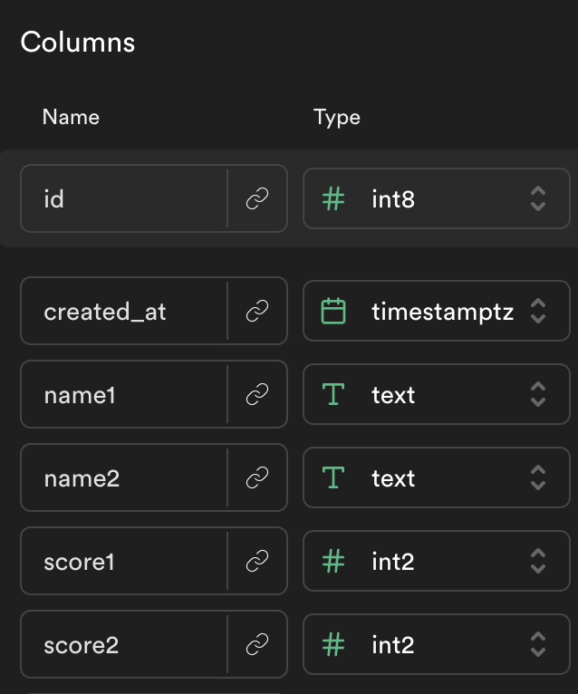

# Supabase Soccer Scorekeeper

## Learning Objectives

-   Create an object containing complex values (objects or arrays) and access any item in that complex object using dot and bracket notation
-   Display errors to users with an alert inside a .catch block
-   In response to a user event, make a fetch call add a new object to the database and display the new state to the user.

## Setup

Here is the model for the `games` table - you should add a new table called `games` to your Supabase database with these columns:

### Live Example:

https://alchemycodelab.github.io/web-01-soccer-scorekeeper-supabase/

| Grading Rubric                                                                                                               |     |
| ---------------------------------------------------------------------------------------------------------------------------- | --- |
| Events                                                                                                                       |     |
| On the games page load, see a form and empty current game div                                                                | 1   |
| On the games page load, fetch all past games and render them to the past games div                                           | 1   |
| On submit, add the team names to the current game div                                                                        | .5  |
| On clicking add or subtract, increment and decrement the correct score in the current game div                               | .5  |
| On clicking finish, empty the current game div, and use supabase to add the current game to the database.                    | 1   |
| On clicking finish, clear the past games div, then fetch all past games from supabase and render them in the past games div. | 1   |
| Functions                                                                                                                    |     |
| :-----------------------------------------------------------------------------------------                                   | --: |
| IMPURE: `displayCurrentGameEl()` : displays the form state to the current game DOM element                                   | .5  |
| IMPURE: `displayAllGames()` : clears out and appends to games div                                                            | .5  |
| ASYNC: `createGame(game)` : creates a game for currently logged in user in supabase                                          | 2   |
| ASYNC: `getGames()` : returns games for currently logged in user from supabase                                               | 2   |
